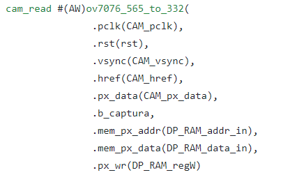
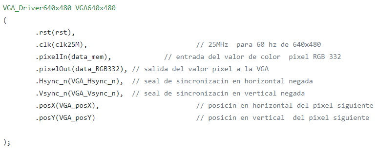

## TRABAJO FINAL DIGITAL I
BYRON ADOLFO ERAZO CHALUPUD

JHON EDISON BOHORQUEZ MARTINEZ

## INTRODUCCIÓN
En esta entrega se recoge todo el proceso seguido en el diseño e implementación de una cámara digital el cual se inicia con entrega 1 uno llamado work01 en donde se dio respuesta a interrogantes para la implementación la memoria RAM que utilizara la camara para el procesamiento de la imagen. En la segunda entrega work realizó el diseño e implementación de la captura de datos de la cámara "captura_datos_downsampler" según la configuración 320x240 16b pixel. Además de esto se realiza la adaptación del bloque PLL según la tarjeta de desarrollo Nexys 4 la cual cuenta con un dispositivo FPGA de la nueva familia de XILINX ARTIX  XC7A100T-1CSG324C. Para la tercera entrega work03 se realiza el diseño del cam_reed.v que permite la captura de datos por medio del uso de un botón externo.
## DESARROLLO DE MODULOS DE LA CAMARA

**1.	Contador de Pixel y Href WP02**

En este trabajo se realiza el diseño e implementación de la captura de datos de la cámara "captura_datos_downsampler" según la configuración 320x240 16b pixel. Además de esto se realiza la adaptación del bloque PLL, teniendo en cuenta que la señal de reloj viene de la FPGA Spartan 6 y la seleccionada por el grupo para la implementación del proyecto corresponde a la Artix 7, así como la adaptación de los datos para que se almacenen en la memoria, teniendo en cuenta que el formato debe ser RGB332. Una vez diseñado e implementado el bloque "captura_datos_dawnsampler", se procede a instanciarlo en el test_cam.v para probar la funcionalidad del diseño.
**Instanciación de modulos.** Lo primero que se realiza esd la instanciación de los nuevos modulos que componen el proyecto, entre estos se encuentra el modulo **clk_25_nexys4.v** 

Se instanciaron los modulos de entrada y salidas del cam_read.v, partiendo del paquete del repositorio.

en donde se tiene como entradas de la camara (.pclk,rst, vsync, href, px_data, b_captura) y como salidas del modulo **tes_cam.v**  (mem_px_addr, mem_px_data, px_wr).

Instanciación salida VGA.

